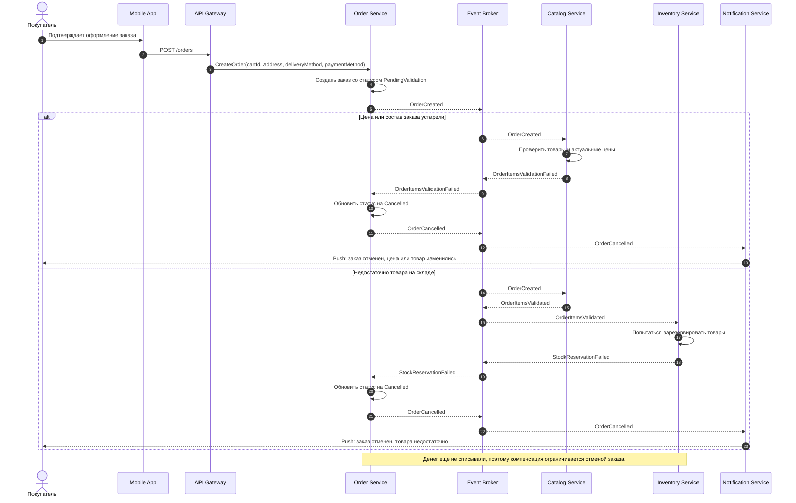

# Ошибка до оплаты: цена изменилась или товара не хватает

---

```mermaid
sequenceDiagram
autonumber
actor Buyer as Покупатель
participant Mobile as Mobile App
participant Gateway as API Gateway
participant Order as Order Service
participant Broker as Event Broker
participant Catalog as Catalog Service
participant Inventory as Inventory Service
participant Notify as Notification Service

Buyer->>Mobile: Подтверждает оформление заказа
Mobile->>Gateway: POST /orders
Gateway->>Order: CreateOrder(cartId, address, deliveryMethod, paymentMethod)
Order->>Order: Создать заказ со статусом PendingValidation
Order-->>Broker: OrderCreated

alt Цена или состав заказа устарели
  Broker-->>Catalog: OrderCreated
  Catalog->>Catalog: Проверить товары и актуальные цены
  Catalog-->>Broker: OrderItemsValidationFailed
  Broker-->>Order: OrderItemsValidationFailed
  Order->>Order: Обновить статус на Cancelled
  Order-->>Broker: OrderCancelled
  Broker-->>Notify: OrderCancelled
  Notify-->>Buyer: Push: заказ отменен, цена или товар изменились
else Недостаточно товара на складе
  Broker-->>Catalog: OrderCreated
  Catalog-->>Broker: OrderItemsValidated
  Broker-->>Inventory: OrderItemsValidated
  Inventory->>Inventory: Попытаться зарезервировать товары
  Inventory-->>Broker: StockReservationFailed
  Broker-->>Order: StockReservationFailed
  Order->>Order: Обновить статус на Cancelled
  Order-->>Broker: OrderCancelled
  Broker-->>Notify: OrderCancelled
  Notify-->>Buyer: Push: заказ отменен, товара недостаточно
end

Note over Order,Inventory: Денег еще не списывали, поэтому компенсация ограничивается отменой заказа.
```

---
