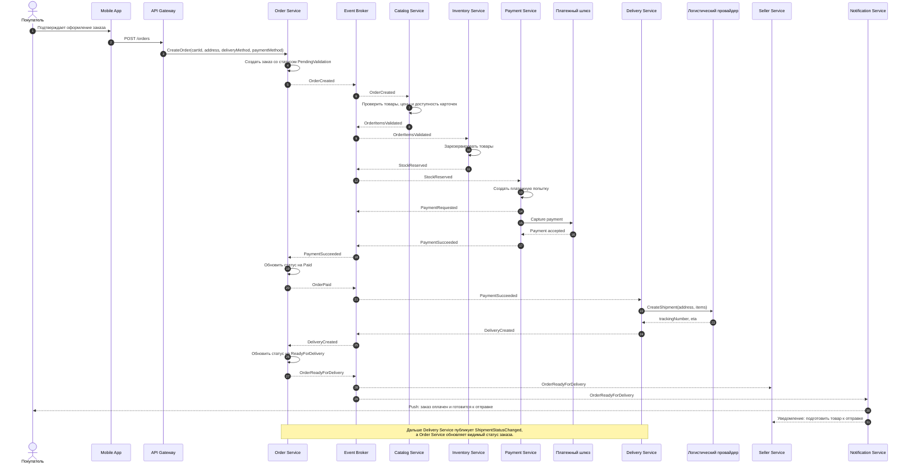
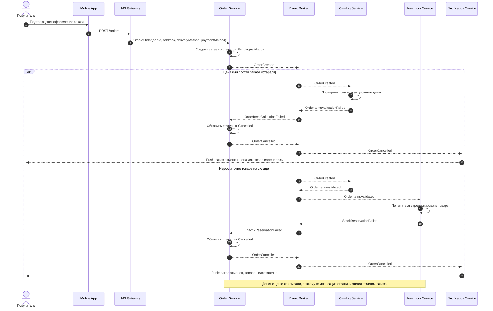
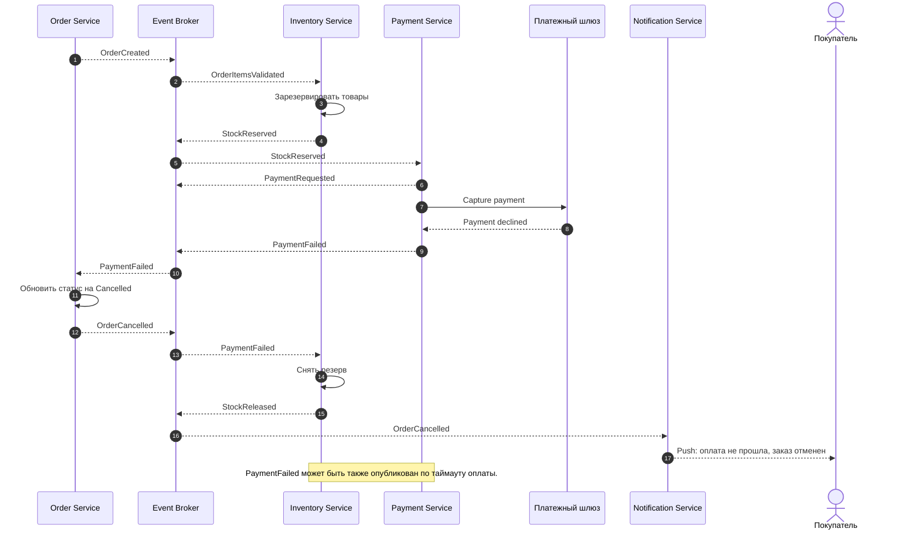
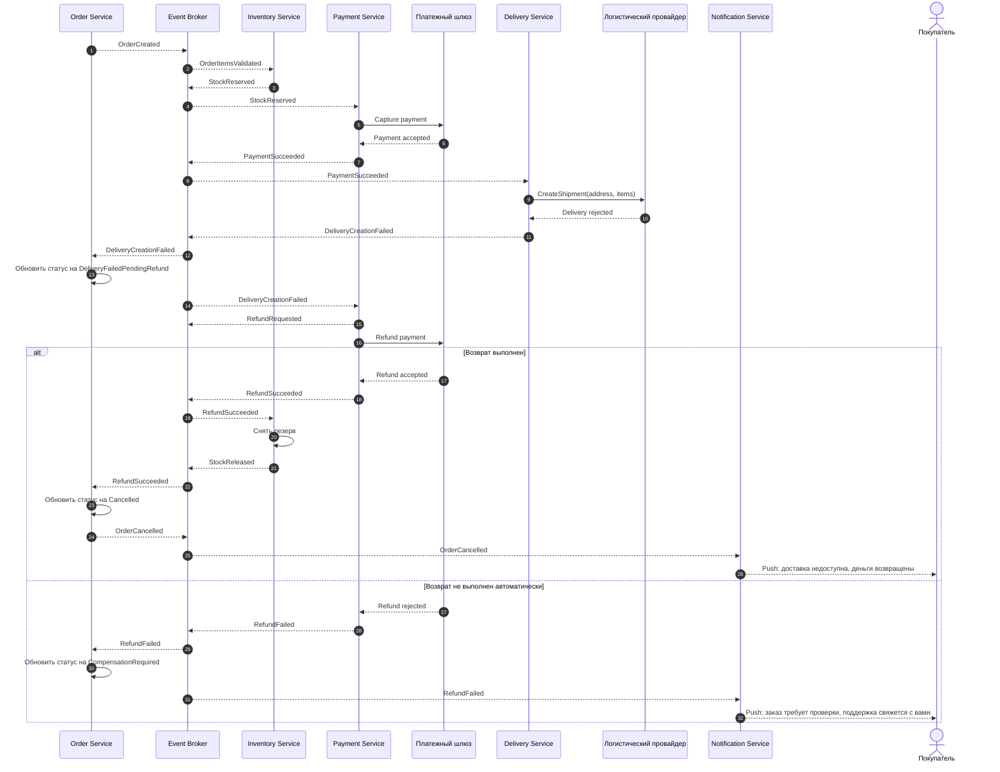

# Sequence-диаграммы Saga-хореографии оформления заказа

## Успешное оформление заказа

## Ошибка до оплаты: цена изменилась или товара не хватает

## Ошибка оплаты: резерв нужно снять

## Ошибка доставки после оплаты: нужен возврат

