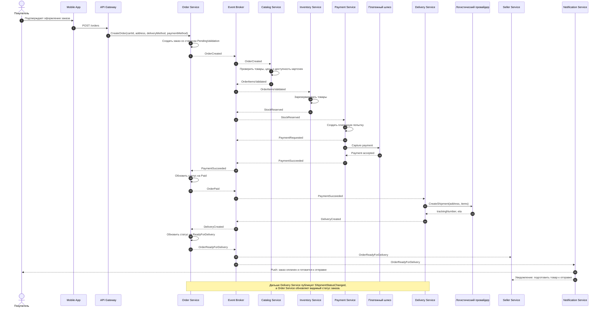

# Успешное оформление заказа

---

```mermaid
sequenceDiagram
autonumber
actor Buyer as Покупатель
participant Mobile as Mobile App
participant Gateway as API Gateway
participant Order as Order Service
participant Broker as Event Broker
participant Catalog as Catalog Service
participant Inventory as Inventory Service
participant Payment as Payment Service
participant PayGate as Платежный шлюз
participant Delivery as Delivery Service
participant Logistics as Логистический провайдер
participant Seller as Seller Service
participant Notify as Notification Service

Buyer->>Mobile: Подтверждает оформление заказа
Mobile->>Gateway: POST /orders
Gateway->>Order: CreateOrder(cartId, address, deliveryMethod, paymentMethod)
Order->>Order: Создать заказ со статусом PendingValidation
Order-->>Broker: OrderCreated

Broker-->>Catalog: OrderCreated
Catalog->>Catalog: Проверить товары, цены и доступность карточек
Catalog-->>Broker: OrderItemsValidated

Broker-->>Inventory: OrderItemsValidated
Inventory->>Inventory: Зарезервировать товары
Inventory-->>Broker: StockReserved

Broker-->>Payment: StockReserved
Payment->>Payment: Создать платежную попытку
Payment-->>Broker: PaymentRequested
Payment->>PayGate: Capture payment
PayGate-->>Payment: Payment accepted
Payment-->>Broker: PaymentSucceeded

Broker-->>Order: PaymentSucceeded
Order->>Order: Обновить статус на Paid
Order-->>Broker: OrderPaid

Broker-->>Delivery: PaymentSucceeded
Delivery->>Logistics: CreateShipment(address, items)
Logistics-->>Delivery: trackingNumber, eta
Delivery-->>Broker: DeliveryCreated

Broker-->>Order: DeliveryCreated
Order->>Order: Обновить статус на ReadyForDelivery
Order-->>Broker: OrderReadyForDelivery

Broker-->>Seller: OrderReadyForDelivery
Broker-->>Notify: OrderReadyForDelivery
Notify-->>Buyer: Push: заказ оплачен и готовится к отправке
Notify-->>Seller: Уведомление: подготовить товар к отправке

Note over Order,Delivery: Дальше Delivery Service публикует ShipmentStatusChanged,<br/>а Order Service обновляет видимый статус заказа.
```

---

