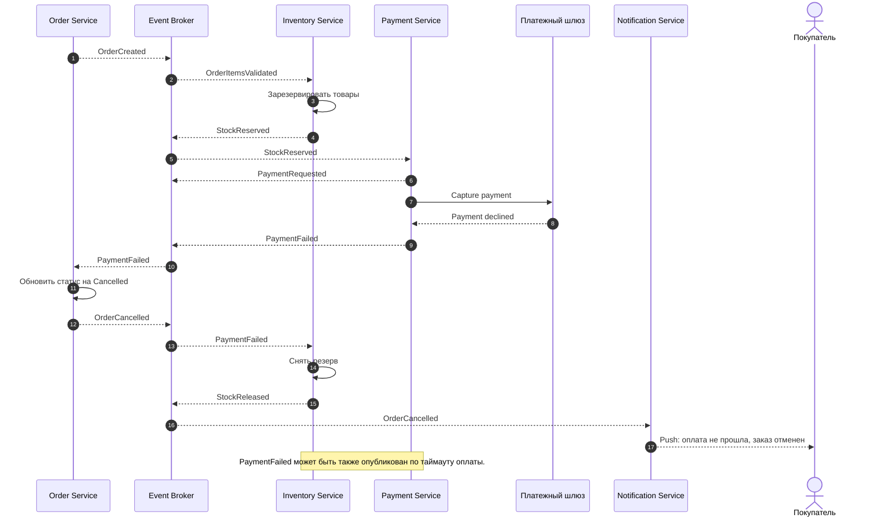

---

# Ошибка оплаты: резерв нужно снять

```mermaid
sequenceDiagram
autonumber
participant Order as Order Service
participant Broker as Event Broker
participant Inventory as Inventory Service
participant Payment as Payment Service
participant PayGate as Платежный шлюз
participant Notify as Notification Service
actor Buyer as Покупатель

Order-->>Broker: OrderCreated
Broker-->>Inventory: OrderItemsValidated
Inventory->>Inventory: Зарезервировать товары
Inventory-->>Broker: StockReserved
Broker-->>Payment: StockReserved
Payment-->>Broker: PaymentRequested
Payment->>PayGate: Capture payment
PayGate-->>Payment: Payment declined
Payment-->>Broker: PaymentFailed

Broker-->>Order: PaymentFailed
Order->>Order: Обновить статус на Cancelled
Order-->>Broker: OrderCancelled

Broker-->>Inventory: PaymentFailed
Inventory->>Inventory: Снять резерв
Inventory-->>Broker: StockReleased

Broker-->>Notify: OrderCancelled
Notify-->>Buyer: Push: оплата не прошла, заказ отменен

Note over Payment,Inventory: PaymentFailed может быть также опубликован по таймауту оплаты.
```

---
