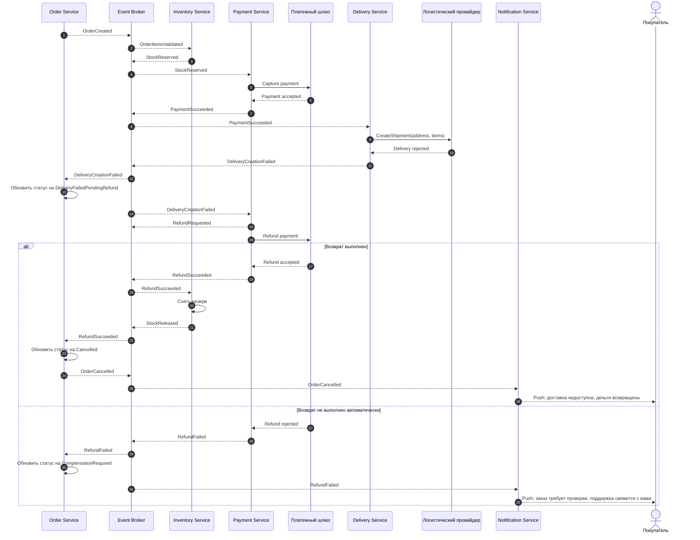

---

## Ошибка доставки после оплаты: нужен возврат

```mermaid
sequenceDiagram
autonumber
participant Order as Order Service
participant Broker as Event Broker
participant Inventory as Inventory Service
participant Payment as Payment Service
participant PayGate as Платежный шлюз
participant Delivery as Delivery Service
participant Logistics as Логистический провайдер
participant Notify as Notification Service
actor Buyer as Покупатель

Order-->>Broker: OrderCreated
Broker-->>Inventory: OrderItemsValidated
Inventory-->>Broker: StockReserved
Broker-->>Payment: StockReserved
Payment->>PayGate: Capture payment
PayGate-->>Payment: Payment accepted
Payment-->>Broker: PaymentSucceeded

Broker-->>Delivery: PaymentSucceeded
Delivery->>Logistics: CreateShipment(address, items)
Logistics-->>Delivery: Delivery rejected
Delivery-->>Broker: DeliveryCreationFailed

Broker-->>Order: DeliveryCreationFailed
Order->>Order: Обновить статус на DeliveryFailedPendingRefund

Broker-->>Payment: DeliveryCreationFailed
Payment-->>Broker: RefundRequested
Payment->>PayGate: Refund payment

alt Возврат выполнен
  PayGate-->>Payment: Refund accepted
  Payment-->>Broker: RefundSucceeded
  Broker-->>Inventory: RefundSucceeded
  Inventory->>Inventory: Снять резерв
  Inventory-->>Broker: StockReleased
  Broker-->>Order: RefundSucceeded
  Order->>Order: Обновить статус на Cancelled
  Order-->>Broker: OrderCancelled
  Broker-->>Notify: OrderCancelled
  Notify-->>Buyer: Push: доставка недоступна, деньги возвращены
else Возврат не выполнен автоматически
  PayGate-->>Payment: Refund rejected
  Payment-->>Broker: RefundFailed
  Broker-->>Order: RefundFailed
  Order->>Order: Обновить статус на CompensationRequired
  Broker-->>Notify: RefundFailed
  Notify-->>Buyer: Push: заказ требует проверки, поддержка свяжется с вами
end
```

---
